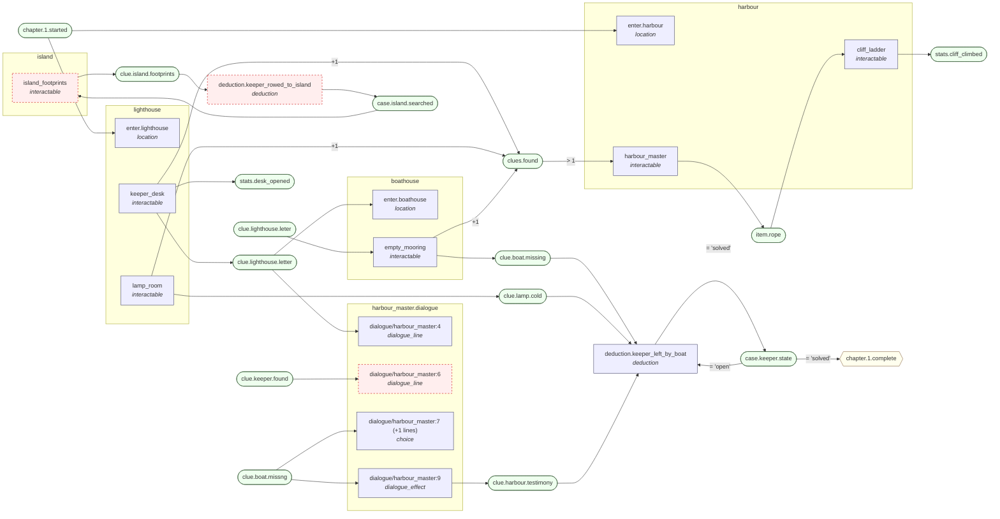

# Chapter 1 flow (generated)

Generated with `factgraph graph --chapter 1 --config examples/lighthouse/factgraph.toml`. Red dashed boxes are unreachable beats.

```mermaid
flowchart LR
  subgraph g1["harbour_master.dialogue"]
    n1["dialogue/harbour_master:4<br/><i>dialogue_line</i>"]:::beat
    n2["dialogue/harbour_master:6<br/><i>dialogue_line</i>"]:::unreachable
    n3["dialogue/harbour_master:7 (+1 lines)<br/><i>choice</i>"]:::beat
    n4["dialogue/harbour_master:9<br/><i>dialogue_effect</i>"]:::beat
  end
  subgraph g2["harbour"]
    n5["enter.harbour<br/><i>location</i>"]:::beat
    n6["harbour_master<br/><i>interactable</i>"]:::beat
    n7["cliff_ladder<br/><i>interactable</i>"]:::beat
  end
  subgraph g3["lighthouse"]
    n8["enter.lighthouse<br/><i>location</i>"]:::beat
    n9["keeper_desk<br/><i>interactable</i>"]:::beat
    n10["lamp_room<br/><i>interactable</i>"]:::beat
  end
  subgraph g4["boathouse"]
    n11["enter.boathouse<br/><i>location</i>"]:::beat
    n12["empty_mooring<br/><i>interactable</i>"]:::beat
  end
  subgraph g5["island"]
    n13["island_footprints<br/><i>interactable</i>"]:::unreachable
  end
  n14["deduction.keeper_left_by_boat<br/><i>deduction</i>"]:::beat
  n15["deduction.keeper_rowed_to_island<br/><i>deduction</i>"]:::unreachable
  n16(["case.island.searched"]):::fact
  n17(["case.keeper.state"]):::fact
  n18(["chapter.1.started"]):::fact
  n19(["clue.boat.missing"]):::fact
  n20(["clue.boat.missng"]):::fact
  n21(["clue.harbour.testimony"]):::fact
  n22(["clue.island.footprints"]):::fact
  n23(["clue.keeper.found"]):::fact
  n24(["clue.lamp.cold"]):::fact
  n25(["clue.lighthouse.leter"]):::fact
  n26(["clue.lighthouse.letter"]):::fact
  n27(["clues.found"]):::fact
  n28(["item.rope"]):::fact
  n29(["stats.cliff_climbed"]):::fact
  n30(["stats.desk_opened"]):::fact
  n31{{"chapter.1.complete"}}:::goal
  n4 --> n21
  n9 --> n26
  n9 -- "+1" --> n27
  n9 --> n30
  n10 --> n24
  n10 -- "+1" --> n27
  n12 --> n19
  n12 -- "+1" --> n27
  n6 --> n28
  n7 --> n29
  n13 --> n22
  n14 -- "= 'solved'" --> n17
  n15 --> n16
  n26 --> n1
  n23 --> n2
  n20 --> n3
  n20 --> n4
  n18 --> n5
  n18 --> n8
  n26 --> n11
  n25 --> n12
  n27 -- "> 1" --> n6
  n28 --> n7
  n16 --> n13
  n19 --> n14
  n24 --> n14
  n21 --> n14
  n17 -- "= 'open'" --> n14
  n22 --> n15
  n17 -- "= 'solved'" --> n31
  classDef beat fill:#eef,stroke:#446
  classDef fact fill:#efe,stroke:#464
  classDef goal fill:#ffe,stroke:#864
  classDef unreachable fill:#fee,stroke:#c00,stroke-dasharray:4
```
